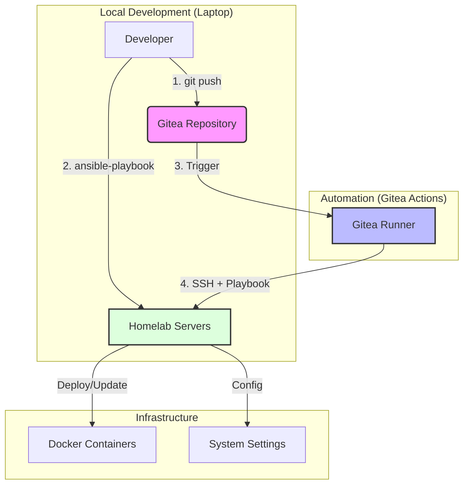

### Ansible Integration Proposal for Homelab

To transition your manual `docker-compose` setup to an automated Ansible-based configuration, I propose the following structure and workflow. This setup allows you to maintain control from your laptop while enabling CI/CD via Gitea Actions.

#### 1. Proposed Directory Structure
Creating a dedicated `ansible` directory ensures a clean separation between your Docker configurations and automation logic.

```text
ansible/
├── ansible.cfg          # Default settings (inventory path, SSH tuning)
├── inventory.yaml       # List of your homelab servers and their IPs
├── playbooks/
│   ├── homer.yaml       # Specific playbook for Homer
│   └── ...              # Other service-specific playbooks
├── roles/               # Reusable automation blocks
│   ├── docker/          # Ensures Docker engine is installed/ready
│   └── containers/      # Logic to deploy your docker-compose files
└── group_vars/
    └── all.yaml         # Global variables (e.g., PUID, PGID, TZ)
Makefile                 # Entrypoint for common commands
```

#### 2. Workflow Visualization
The following graph describes how changes flow from your laptop to your infrastructure, both manually and automatically.



#### 3. Implementation Details

##### Local Execution
You can run the deployment directly from your laptop. For convenience, a `Makefile` is provided in the project root which automatically maps playbooks to commands.

Run the default deployment:
```bash
make deploy
```

Run a specific playbook (any file in `ansible/playbooks/*.yaml`):
```bash
make homer      # Runs ansible/playbooks/homer.yaml
make <name>     # Runs ansible/playbooks/<name>.yaml
```

Other useful commands:
```bash
make check      # Dry-run mode for default playbook
make ping       # Test connection to servers
make inventory  # View current inventory setup
```

Alternatively, run the raw command:
```bash
ansible-playbook -i ansible/inventory.yaml ansible/playbooks/site.yaml
```

##### Gitea Action (Continuous Deployment)
To automate this on push, create a workflow file at `.gitea/workflows/ansible-deploy.yaml`:

```yaml
name: Ansible Deploy
on:
  push:
    branches: [ main ]
jobs:
  deploy:
    runs-on: ubuntu-latest # Or your specific runner label
    steps:
      - name: Checkout Code
        uses: actions/checkout@v4

      - name: Install SSH Key
        uses: webfactory/ssh-agent@v0.9.0
        with:
          ssh-private-key: ${{ secrets.SSH_PRIVATE_KEY }}

      - name: Run Ansible Playbook
        run: make deploy
```

#### 4. Container Deployment Details
The `homer.yaml` playbook and its roles handle several automated steps:
*   **Infrastructure**: Ensures Docker and its dependencies are installed.
*   **Networks/Volumes**: Automatically creates networks (`proxy`, `media`, `utilites`) and volumes (`utils_pgdata`, etc.).
*   **Homer Config**: Specifically copies `docker/homer/config.yml` to the target host's `/mnt/ppppppppds_docker/homer/assets/config.yml`.
*   **Compose Deploy**: Synchronizes the `docker/` directory and deploys all compose files.

#### 5. Key Recommendations
*   **SSH Access**: Add your Gitea Runner's public key (or a dedicated deployment key) to the `authorized_keys` on your homelab servers. Store the private key in Gitea Secrets as `SSH_PRIVATE_KEY`.
*   **Ansible Modules**: Use the `community.docker.docker_compose_v2` module in your playbooks. It can point directly to your existing `docker/*.yaml` files, making the transition seamless.
*   **Inventory**: Start with a simple YAML inventory to map your services to specific nodes.
*   **Secrets**: Use **Ansible Vault** for sensitive data (like API tokens) within the repository, or inject them via Gitea Secrets during the CI/CD run.
